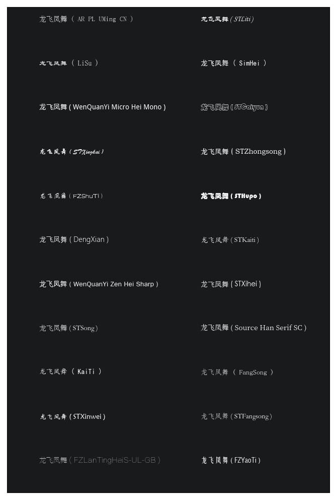

### Repo introduction
I stumbled across the issue of Matplotlib displaying boxes for Chinese a while ago. This repo originated from my frustration with the various post scattering
in the Internet. It is created as a demo on how to use Chinese fonts properly with Matplotlib. Several ways are shown in the script. The scripts are tested both on Linux(CentOS 7.2) and Windows(Windows 8.1 Enterprise Edition) and should be able to run smoothly.
For detailed information, please refer to [this post](https://jdhao.github.io/2017/05/13/guide-on-how-to-use-chinese-with-matplotlib/).

### How to run the code
Run `python main.py --method m1` in command line to see the output, output is like the following.

 
you can try different methods. Valid method names are 'm1','m2' and 'm3'.

### Report an issues
If you encounter problems when running the code, you can [add an issue here](https://github.com/jdhao/matplotlib_chinese_font/issues).
